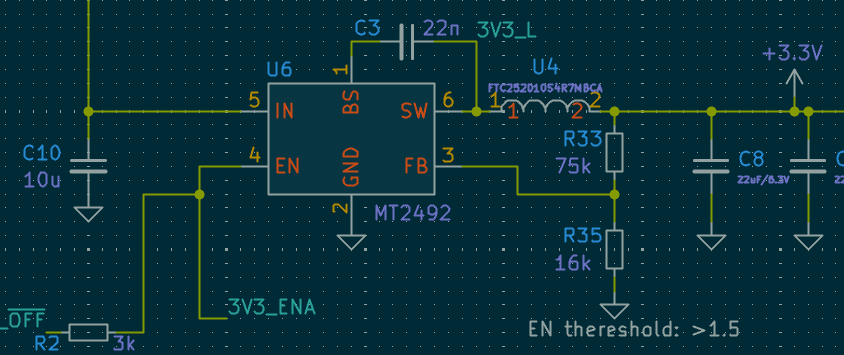

# I2Current powerboard

The Raison d'être of this board is to be a powerful, extensible, and affordable replacement for hotglueing a random powerbank into your next portable small-scale electronic project.

It's most useful for powering devices requiring peak power draw between 15W-60W.

For devices requiring less power, the cost overhead becomes a bit too much - alternative solutions on aliexpress, albeit not this good, can cost less than 3$

## Sub-components

### BQ25792 Li-Ion charger

Specs:

* 3.6-24V input, max 3A (realistically, ~60W)
* Input voltage independent from battery pack (buck-boost built-in)
* Input from USB-C and/or DC barrel jack.
* Can provide up to 3.33A@20V output to the same USB-C port
* can work with 1S-4S (cells in series)
* output current 5A (with 4 cells (~16V), up to ~80W output)
* Works properly without battery pack too (can work as buck-boost power supply)
* Many parameters configurable via i2c
* Various battery/input/output voltages/currents readout

This charger is incredibly universal, costing around 1$ it provides versatility for many types of projects.

### TPS56637 5V output step-down converter

It can provide up to 6A (30W) on output. However, it requires atleast 2S packet to be usable.

### MT2492 3V3 DC-DC

This converter supports optional built-in ESP32-C3 controller, and can also be accesed via output pins

### SPX3819M5-L-3-3 3V3 LDO

This low-power stabilizer provides power to onboard devices and some circuitry. It cannot be turned off, in contrast to 2 other converters.

### FUSB302B Power Delivery controller

This device is controlled via i2c, and can be used to negotiate up to 5A/20V from compatible USB-C chargers.

Arduino library is available.

## Connectors

### Output 2.54 connector

This connector has been designed for low-profile goldpin socket connector (the male header actually goes through the holes in the PCB)

Shield can be designed, utilizing this connector.

### Picoblade connector

This connector is dedicated for devices, where a "master" board sits somewhere else in the system. 

### Battery connector

* Battery input
* NTC resistor input (every battery pack should contain one, more on that later)
* GND
* Battery output (coming from BQ charger, provides stable voltage when baterry is depleated or missing)
* GLOB_OFF (pin for external power-off switch)
* VDC_IN (same as from barrel jack input)

## More to come...

this board has many more fun quirks - I'll describe more details at a later date.

* optional mini front panel with OLED
* Passive-PoE input
* standalone 4-channel WLED controller
* USB data lanes passthrough for 2 connectors and built-in ESP32

#### Todo - document:

* Li-ion safety guide
* USB passthrough
* GLOB_OFF usage
* Pinout description for every connector

## Sponsors

Developent of this board is supported by [Clue.lamp](https://www.instagram.com/clue.lamp/). 

Check them out, the device looks really nice, and utilizes state-of-the-art electronic design for both wired and wireless usage :)